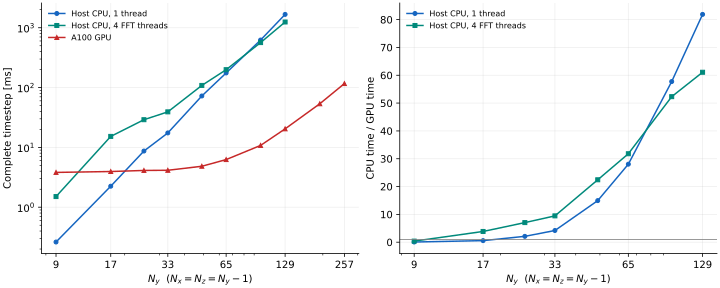
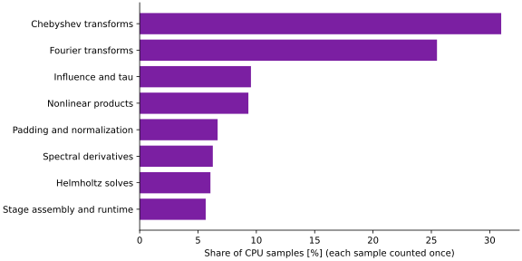
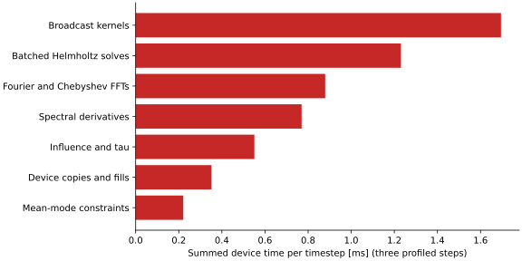

# Complete DNS timestep benchmarks

These scripts measure one three-stage CNRK2 step, including nonlinear products,
Fourier/Chebyshev transforms, pressure–velocity coupling, tau correction, and
the zero mode. They do not time only a Helmholtz kernel.

## Reproduce a size sweep

```sh
CHANNEL_SAMPLES=100 CHANNEL_FFT_THREADS=1 \
  julia --project=. benchmarks/step.jl cpu benchmarks/results/cpu-1.csv
CHANNEL_SAMPLES=100 CHANNEL_FFT_THREADS=4 \
  julia --project=. benchmarks/step.jl cpu benchmarks/results/cpu-4.csv
CHANNEL_SAMPLES=100 \
  julia --project=test/cuda benchmarks/step.jl cuda benchmarks/results/a100.csv
```

Instantiate `test/cuda` first for GPU runs. `CHANNEL_SIZES` is a comma-separated
list of N values; each problem has `(Nx,Ny,Nz)=(N,N+1,N)`. Defaults cover
8,16,24,32,48,64,96,128. Padded physical dimensions are approximately
`(3N/2,3N/2,N+1)`. All calculations use double precision, rotational form,
Couette base flow, `nu=1/400`, and `dt=0.002`.

Planning, factors, transfers, compilation and five warmup steps precede
measurement. Every sample restores the same initial state outside the timed
interval. GPU restoration is synchronized before the timer, and GPU execution
is synchronized before stopping it. Reported time is the minimum of 100
samples; the CSV also records the mean to expose timing variability.
No monitor, diagnostics or disk output runs inside the measurement.
`host_bytes` and `host_allocations` are Julia host allocations; they are **not**
device allocation measurements.

`CHANNEL_FFT_THREADS` controls FFTW and BLAS threads on the CPU. It does not
parallelize every Julia loop or change the number of GPU threads. CPU/GPU
speedups should use measurements on the same node, rather than treating a
laptop CPU as an A100 host CPU. Run sweeps sequentially, not concurrently.

## Profiling

```sh
CHANNEL_PROFILE_N=64 julia --project=. benchmarks/profile.jl cpu > cpu-profile.txt
CHANNEL_PROFILE_N=64 julia --project=test/cuda benchmarks/profile.jl cuda > gpu-profile.txt
```

The CPU report contains a sampling call tree and flat table after warmup.
Inclusive sample counts overlap: do not add them to obtain percentages.
The category CSV assigns each sample inside CNRK2 exactly once and excludes
idle Julia-thread stacks. Folded stacks produce a hoverable SVG flame graph
when rendered with `python benchmarks/plot.py` (requires Matplotlib).
The GPU report records CUDA host calls and device kernel activity over three
warmed timesteps. GPU launch latency, transfers, reductions and library calls
matter alongside arithmetic kernels. Profiling overhead is not included in
the timing sweep.

## Recorded results

The result files and figures in `results/` identify their measured source
revision. Hardware and dependency information accompanies the measurements.
Times depend on FFT planning, libraries, hardware and problem shape; they are
not a claim of speedup against C++ Channelflow.

### Xeon Gold 6336Y and NVIDIA A100 80 GB PCIe

Measured on IRIDIS X (`rose03`), with four allocated CPU cores, Julia 1.12.4,
CUDA.jl 6 and double precision. The CPU and GPU sweeps ran sequentially in the
same allocation. The CSVs record numerical source revision `b691db9`.
Subsequent changes preserve this default timestep path; they add documentation,
profile export fixes, tests and preservation of optional GEMM backend selection.
The benchmark driver includes the later Git-metadata lookup fix (`ae41cb8`).



| Resolved `(Nx,Ny,Nz)` | CPU, 1 thread [ms] | CPU, 4 FFT threads [ms] | GPU [ms] | Best measured CPU / GPU |
|---|---:|---:|---:|---:|
| `(8,9,8)` | 0.262 | 1.507 | 3.816 | 0.07× |
| `(16,17,16)` | 2.245 | 15.263 | 3.950 | 0.57× |
| `(32,33,32)` | 17.448 | 39.246 | 4.145 | 4.21× |
| `(64,65,64)` | 175.463 | 198.926 | 6.256 | 28.05× |
| `(128,129,128)` | 1671.109 | 1246.638 | 20.408 | 61.09× |
| `(256,257,256)` | — | — | 116.614 | — |

The GPU loses on the smallest grids: launch and host-dispatch costs dominate.
It becomes faster at intermediate sizes and reaches about **61×** against the
faster tested CPU configuration at `128×129×128`. Four FFT threads help at
larger sizes but hurt small sizes; the remaining Julia kernels are SIMD loops,
not four-thread loops. CPU measurements stop at `128×129×128`; no CPU speedup
is claimed for the GPU-only 192 and 256 cases. These are comparisons with this
Julia implementation, not with C++ Channelflow.

The steady CPU step reports 3,984 host bytes in 75 allocations, independent of
size in this sweep. GPU host allocations are approximately 1.2 MB per step,
including CUDA runtime bookkeeping; this counter does not measure
device allocation. Cached field/factor storage stays on the device. Reducing
launch overhead is still worthwhile, especially for small grids.

### Where the time goes

The profile uses `64×65×64`. CPU percentages below count each sampled CNRK2
stack once and exclude idle threads. Library work inherits the containing
operation's category. They are sampling estimates, not separately timed phases.



- Chebyshev transforms: **31.0%**; Fourier transforms: **25.5%**.
- Influence/tau correction: **9.5%**; nonlinear products: **9.3%**.
- Padding/normalisation: **6.7%**; spectral derivatives: **6.3%**.
- Batched Helmholtz solves: **6.1%**; stage assembly/runtime: **5.7%**.

[Open the CPU flame graph](results/xeon-phases-flame.svg) and hover over a block
for its function and sample count. The [raw CPU profile](results/xeon-profile.txt)
and [folded stacks](results/xeon-phases.folded) retain the underlying evidence.



The GPU profile captures three warmed steps. Summed device activity is
**17.09 ms**, or **5.70 ms per step**. Broadcast kernels account for about 29.7%,
Helmholtz solves 21.6%, FFT kernels 15.4%, derivatives 13.5%, influence/tau 9.7%,
copies/fills 6.2%, and mean constraints 3.9% of that device time. There are
**570 device activities per step**, including kernels and copies. This explains
why small grids are launch-bound and suggests fusing padding, endpoint weights
and normalisation before changing the numerical solver.

The instrumented trace takes **149.74 ms**: CUPTI substantially perturbs host
execution. Do not use that elapsed time as timestep throughput, and do not add
host CUDA API time to device time. Use the synchronized, unprofiled CSV sweep
for speedups. The [raw GPU report](results/a100-profile.txt) and
[kernel table](results/gpu-kernels.csv) give the detailed breakdown.

The main remaining optimization opportunities are reducing transform/data
movement on CPU, fusing small GPU kernels, and exploring CUDA graphs for a
fixed step. The current measurements do not establish gains for those changes.

### Provenance and validation

Validation passed: **3,078** CPU interface/analytic checks, **833** independent
physical checks, and **118** A100 checks, including full-state agreement through
`128×129×128`, odd periodic sizes, fixed-flux constraints and both GPU transform
backends. The benchmark-sized GPU-only `256×257×256` run is a timing/stability
smoke check, not an independent high-resolution physical validation.


- [A100/host environment](results/a100-environment.txt) and
  [dependency manifest](results/a100-Manifest.toml).
- [CPU analytic checks](results/cpu-tests.txt),
  [physical checks](results/physics-tests.txt), and
  [A100 validation](results/a100-tests.txt).
- [Apple M5 timings](results/apple-m5.csv) at numerical revision `f3a9cb4`,
  Julia 1.12.6: a separate laptop baseline, not used for the GPU speedup curves.
  Its [environment](results/apple-m5-environment.txt),
  [manifest](results/apple-m5-Manifest.toml), and
  [profile](results/apple-m5-profile.txt) are included.

The saved manifests record exact dependency trees; they are provenance files,
not environments to activate from `results/`. To repeat the batch run, adapt
[`iridis.slurm`](iridis.slurm) to your account and submit from the repository
root after installing dependencies. Regenerate figures with
`python benchmarks/plot.py` using Matplotlib.
